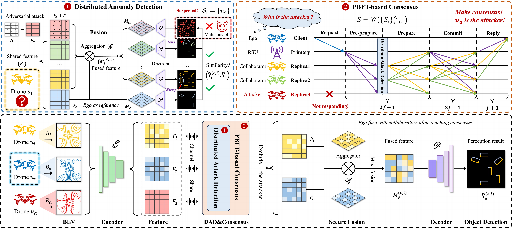

# BTS: Consensus-Driven Anomaly Detection for Multi-Drone Perception
This repository contains the official implementation of the **BTS (Build Trust in Swarm)** framework and the **CoSwarm dataset** proposed in the paper *"Building Trust in the Swarm: Consensus-Driven Anomaly Detection for Multi-Drone Perception"*.



## Abstract 
Multi-drone collaborative perception is important for secure and efficient low-altitude applications. Trust among drones is a foundation for reliable environmental awareness. However, shared perceptual data is vulnerable to adversarial attacks, which can damage integrity and break collaboration. Existing defenses are often not developed for dynamic drone swarms. They are costly, depend on heuristics, or lack a clear way to reach consensus and build trust. To address these gaps, we propose \underline{B}uild \underline{T}rust in \underline{S}warm (BTS), a consensus-driven anomaly detection framework for drone swarms. BTS integrates a distributed anomaly detection algorithm, enabling each drone to identify suspicious attackers through the consistency of perception results, combined with the Practical Byzantine Fault Tolerance (PBFT) mechanism to make consensus on excluding malicious nodes. We also introduce CoSwarm, a large-scale multi-modal dataset capturing bird’s eye view (BEV) perception from drones and roadside units (RSUs) in complex traffic scenarios for security-oriented collaborative perception. Extensive simulations show that BTS achieves over 84\% latency reduction and improves the average precision of collaborative perception by 9.7\% over state-of-the-art methods, and enhances the security and robustness of multi-drone systems in critical tasks.


## Dataset: CoSwarm
### Key Features
- **Scale**: 10,000 frames (100 scenes × 100 frames/scene) of synchronized LiDAR/RGB data.
- **Sensors**: 32-channel LiDAR (100m range, 1.2M points/s) and RGB cameras (800×800 resolution, 110° FoV) on drones (40m altitude) and RSU (15m altitude).
- **Annotations**: 3.18M 3D bounding boxes, 23 object classes, 8 attribute types, and drone trajectories.
- **Scenarios**: Dynamic urban traffic (200+ vehicles) in CARLA’s Town03/Town05, supporting 4-drone or 7-drone swarms.

### Download
The CoSwarm dataset is available on Hugging Face. Download via the [Hugging Face Dataset Repository](https://huggingface.co/datasets/liuzh594/CoSwarm) 

### Extraction
Follow these steps to verify and extract the dataset:
1. Verify file integrity with `md5sum -c checksums.md5`.
2. Extract large split archives (e.g., `samples`/`sweeps`):
   ```bash
   cat samples.tar.gz.* | pigz -d | tar -xvf -
   cat sweeps.tar.gz.* | pigz -d | tar -xvf -
   ```
3. Extract small archives:
   ```bash
   tar -xzvf v1.0.tar.gz
   tar -xzvf maps.tar.gz
   ```


## Code Implementation
### 1. Environment Setup and Installation
Clone this repository BTS:

```bash
git clone https://github.com/your-username/BTS.git
cd BTS
```
And then follow the [Installation](./docs/Installation.md) doc

### 2. Usage
#### 2.1 Training
Train the BTS framework on the Parsed CoSwarm dataset (supports DDP or DP with multiple GPUs):
> If you don't want use the default arguments, you can enter the training file to modify the default parameters of the code or add command line parameters
+ DP: [train_bts.py](coperception/tools/det/BTS/train_bts.py)
```bash
python train_bts.py
```

+ DDP: [train_bts_ddp.py](coperception/tools/det/BTS/train_bts_ddp.py) (default 4 GPUs)
```bash
python train_bts_ddp.py
```

#### 2.2 Test
Run anomaly detection and secure collaborative perception on test data:
```bash
# coperception/tools/det/BTS
python BTS.py
```
## Parameter settings

### I. Basic Mandatory Parameters (Confirm Every Run)

| Parameter     | Description                                               | Example Value                     |
|---------------|-----------------------------------------------------------|-----------------------------------|
| `--data`/-d   | Path to dataset (replace `{your location}`)               | `-d /{your location}/CoSwarm-det` |
| `--num_agent` | Total number of collaborative agents (4~7 Drones + 1 RSU) | `--num_agent 6`                   |
| `--com`       | Feature fusion strategy                                   | `--com max`                       |


### II. Training-Related Parameters
| Parameter   | Description                                                | Example Value                            |
|-------------|------------------------------------------------------------|------------------------------------------|
| `--nepoch`  | Total training epochs                                      | `--nepoch 50`                            |
| `--batch`   | Scene-level batch size                                     | `--batch 4`                              |
| `--lr`      | Initial learning rate                                      | `--lr 0.001`                             |
| `--resume`  | Path to saved model for resuming training                  | `--resume /{your location}/epoch_50.pth` |
| `--log`     | Enable logging (no value needed; add the flag to activate) | `--log`                                  |
| `--logpath` | Path to save log files                                     | `--logpath /{your location}/logs`        |


### III. Adversarial Attack & Defense Parameters
| Parameter      | Description                         | Example Value      |
|----------------|-------------------------------------|--------------------|
| `--adv_method` | Adversarial attack method           | `--adv_method pgd` |
| `--eps`        | Perturbation strength               | `--eps 1.0`        |
| `--pbft`       | PBFT defense mode                   | `--pbft pbft_mAP`  |
| `--tolerant`   | Number of tolerable malicious nodes | `--tolerant 1`     |


### IV. Inference & Visualization Parameters
| Parameter         | Description                                            | Example Value     |
|-------------------|--------------------------------------------------------|-------------------|
| `--scene_id`      | Target evaluation scene ID                             | `--scene_id 81`   |
| `--visualization` | Visualize inference results (add the flag to activate) | `--visualization` |
| `--ego_agent`     | ID of the ego agent                                    | `--ego_agent 3`   |


## Results
### Main Performance
Comparison of defense performance between BTS and different baselines

| Baseline    | AP@IoU=0.5 | AP@IoU=0.7 |
|-------------|------------|------------|
| IUB         | 73.7       | 66.6       |
| UB (oracle) | 71.2       | 64.8       |
| **BTS (ours)**  | **71.1**       | **65.0**       |
| ROBOSAC     | 65.3       | 59.3       |
| LB          | 55.7       | 50.0       |
| ND          | 23.1       | 22.2       |


## Paper Citation
If you use BTS or the CoSwarm dataset in your research, please cite our paper:
```bibtex
need to add
```

## Acknowledgment
BTS is modified from [coperception](https://github.com/coperception/coperception) library.

The collection script of CoSwarm  is modified from [carla_nuscenes](https://github.com/cf206cd/carla_nuscenes)

This project is not possible without these great codebases.

## Contact
For questions, please contact in issues.
